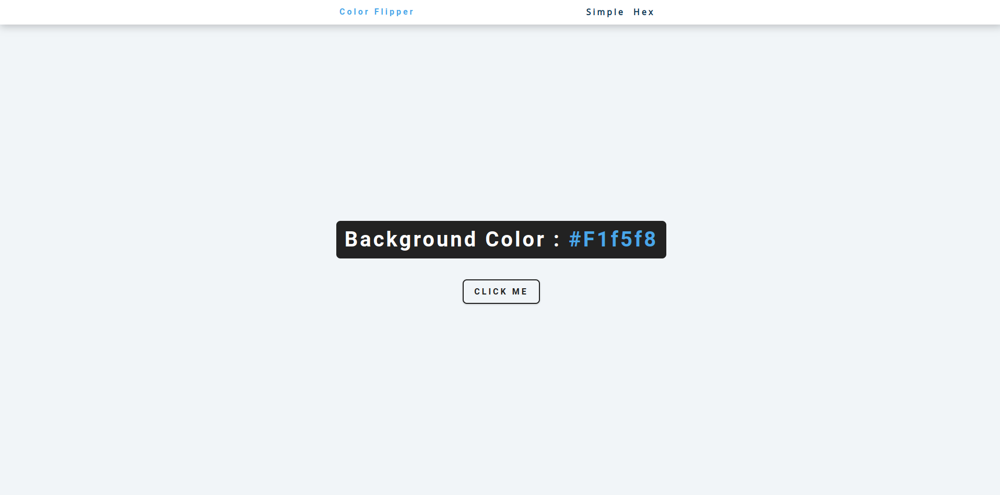

# Cores Aleatórias

Este é um simples aplicativo de gerador de cores aleatórias desenvolvido em HTML, CSS e JavaScript. O aplicativo gera cores aleatórias de forma dinâmica e permite que você veja o código RGB/hexadecimal da cor.

## Funcionalidades:

- Geração de cores aleatórias com um único clique.
- Exibição do código RGB/hexadecimal da cor gerada.

## Tecnologias utilizadas:

- HTML
- CSS
- JavaScript

## Como usar:

1. Clone este repositório em seu ambiente local.
2. Abra o arquivo `index.html` em seu navegador web.
3. Selecione o formato do código da cor.
4. Clique no botão "CLICK ME" para obter uma cor aleatória.
